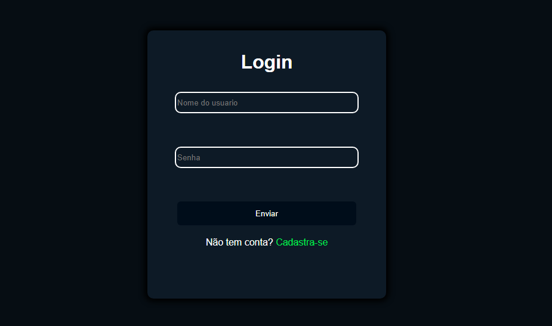

# spring-project-manager

## Tecnologias utilizadas

    
## Descrição

Aplicação criada para o gerenciamento de projetos por meio de uma API REST, sendo cada projeto coordenado por um único administrador e organizado em times e tarefas, onde os times podem incluir gerentes e/ou membros, cada um com regras de acesso e responsabilidades específicas. A API contém autenticação via Spring Security e persistência em PostgreSQL.
### Papéis dos usuários

Nesta aplicação há três tipos de usuários:

| Papéis  | Função                                                                                                                      |
|---------|-----------------------------------------------------------------------------------------------------------------------------|
| Admin   | É o criador do projeto, tendo acesso total ao seu gerenciamento.                                                         |
| Manager | Pode gerenciar as tarefas do seu time e   consultar dados do projeto em que se encontra.                                 |
| Member  | Terá acesso somente à consulta de  informações do seu projeto e também a atualização da tarefa à qual está vinculado. |

## Arquitetura do projeto

### Arquitetura em camadas

A arquitetura do projeto foi dividida nas seguintes camadas:

- **Controller:** é responsável por expor os endpoints da aplicação.
- **Service:** contém a lógica de negócio da aplicação.
- **Repository:** possui os métodos CRUD para a persistência de dados no banco.
- **Entity:** representa o mapeamento das tabelas do banco de dados.
- **DTO:** utilizado para transferência de dados entre cliente e servidor.
- **Mapper:** responsável pela conversão entre entidades e DTOs (utilizando MapStruct).
- **Security:** configuração de autenticação e autorização com Spring Security.
- **Exception Handler:** tratamento global de exceções da aplicação.
## Como executar o projeto

### Baixando a aplicação

- Clique no botão verde `<> Code ▼` → Clique em `HTTPS` → Copie a URL.
- Abra o Git Bash → Execute o comando `git clone <URL copiada>` → Entre na pasta da aplicação.

### Gerando o JAR e rodando a aplicação

Execute os seguintes comandos no prompt:
- `mvnw.cmd clean package -DskipTests`
- `docker compose up -d --build`

Agora acesse `localhost:8080` no seu navegador e aguarde alguns instantes até que a página seja carregada. Essa será a tela inicial:

Clique em `Cadastre-se` e crie uma nova conta. Por fim, você será enviado para a página do Swagger, onde estão os endpoints.
